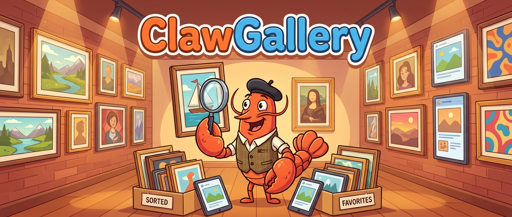

<div align="center">



# ClawGallery

**A friendly, agent-native gallery for all your screenshots and photos.**

</div>

---

## What is ClawGallery?

Your screenshots folder is a mess. Hundreds of `Screenshot 2025-11-01 at 14.32.55.png` and `IMG_0034.jpg` files, and no way to find the one you actually need.

ClawGallery is a small, fast command-line tool that turns that pile into a searchable gallery. Think of it as a tidy little lobster curator that:

- **Indexes** the image folders you point it at.
- **Understands** what's in each picture using a vision model, writing a title and caption for it.
- **Searches** by keyword *or* by visual meaning ("that login error screen") so you can find images even when the filename says nothing.
- **Renames** auto-generated filenames into human-readable ones — safely, with a dry-run by default.
- **Deduplicates**, finding exact and visually-similar copies.

Everything is stored as plain, append-only JSONL files on your own machine. No cloud, no database daemon, no lock-in. It's built to be driven by both humans and AI agents (every command speaks `--json`).

Supported formats: `png`, `jpg`, `jpeg`, `webp`, `avif`, `gif`, `heic`, `heif`. HEIC/HEIF images are converted to JPEG automatically before captioning (macOS uses `sips` by default; set `CLAWGALLERY_HEIC_CONVERTER` to use a different tool).

---

## Install

```bash
# Build, test, and install into your PATH
make ci
cargo install --path .
```

> **Enjoying ClawGallery? Please star the repo!** ⭐️
> It genuinely helps the project grow. If you have the GitHub CLI installed, it's one command:
>
> ```bash
> gh repo star NomaDamas/ClawGallery
> ```

---

## Quickstart

Get from zero to a searchable gallery in a few commands:

```bash
clawgallery init                    # set up local state
clawgallery folder add ~/Desktop    # tell it where your images live
clawgallery bootstrap               # scan the folders and index images
clawgallery search screenshot       # search by keyword right away
```

Want AI-generated titles and captions, then cleaner filenames? Preview first (everything below is a safe dry-run):

```bash
clawgallery caption --dry-run       # see what would be captioned
clawgallery rename --dry-run        # see the filename suggestions
```

When you're happy, drop `--dry-run` (and add `--apply` to actually rename files).

---

## Everyday usage

### 1. Point it at your images

```bash
clawgallery folder add ~/Pictures
clawgallery folder add ~/Pictures/screenshots --recursive
clawgallery folder list
clawgallery bootstrap               # add --prune to drop files deleted on disk
```

### 2. Caption your images

Captioning asks a vision model to describe each image, which powers better search and renaming. It can call a paid API, so **always preview first**:

```bash
clawgallery caption --dry-run
clawgallery caption --missing       # caption everything not yet captioned
clawgallery caption --file ~/Pictures/one.png
```

You'll need credentials for a provider (see [Vision model setup](#vision-model-setup)).

### 3. Search

By default, search is **hybrid**: it matches captions and filenames by keyword *and*, if you've built a visual index, finds images that *look* like your query.

```bash
clawgallery search "login error"
clawgallery search "login error" --json --limit 5
clawgallery search --mode keyword "github actions"    # text only
clawgallery search --mode embedding "sunset photo"    # visual only
```

Search understands fzf-style operators:

| Syntax | Meaning | Example |
|---|---|---|
| `foo bar` | Match both terms (fuzzy) | `clawgallery search login error` |
| `'foo` | Exact substring | `clawgallery search "'github"` |
| `^foo` | Starts with | `clawgallery search ^Login` |
| `foo$` | Ends with | `clawgallery search modal$` |
| `!foo` | Exclude | `clawgallery search login !test` |
| `\ ` | Literal space | `clawgallery search github\ actions` |

Lowercase queries are case-insensitive; add an uppercase letter (or `--case-sensitive`) to match case exactly. If nothing matches, ClawGallery automatically retries with typo tolerance. Use `--no-fuzzy` for plain exact-substring output.

### 4. Rename messy filenames

ClawGallery only renames files that *look* auto-generated (like `IMG_0034` or `Screenshot 2025-…`) and leaves your meaningful names alone. It never overwrites existing files and is **dry-run by default**:

```bash
clawgallery rename --dry-run        # preview
clawgallery rename --apply          # actually rename
clawgallery rename --undo --last    # undo the last applied rename
```

More on how it stays safe in [Rename safety](#rename-safety).

### 5. Find duplicates

`dedup` only *reports* — it never deletes anything:

```bash
clawgallery dedup                   # exact duplicates (same content)
clawgallery vdr sync                # build the visual index first
clawgallery dedup --similar --threshold 0.95 --json
```

To remove a duplicate you chose yourself: `clawgallery forget --file <path> --delete` (or omit `--delete` to just stop tracking it).

### 6. Keep it up to date automatically

Poll a folder for new images on an interval:

```bash
clawgallery poll --interval 30
clawgallery poll --interval 30 --caption --sync   # also caption + reindex each pass
```

`--caption` captions new images each pass; `--sync` then updates the visual index. Failures are logged to `errors.jsonl` and reported without stopping the loop.

Or run it as a background service (see [Run as a background service](#run-as-a-background-service)).

---

## Visual search (VDR)

"Visual Document Retrieval" is what lets ClawGallery find images by how they *look*, not just by their captions. It's optional — plain keyword search works without it — but it's what makes "find that screenshot of the error dialog" work even when the filename is garbage.

### How it works

ClawGallery stores image embeddings in an embedded SQLite file (`vdr.sqlite3`) right alongside your other state. No separate vector database, no extra daemon to babysit. Building the index is incremental: unchanged images and captions are skipped, and only new or changed content is re-embedded.

The embedding model itself runs in Python (the best late-interaction ColQwen-family runtimes on macOS are MLX/Python-based), but ClawGallery starts, waits for, and shuts down that runtime for you.

### Setup (macOS, recommended)

```bash
brew install rust uv
cargo install --path .

# Install the embedding runtime once
uv tool install mlx-embeddings --with pillow --with torch --with torchvision

# Build the visual index — ClawGallery starts the model server automatically
CLAWGALLERY_PYTHON="$(uv tool dir)/mlx-embeddings/bin/python" clawgallery vdr sync
```

Then just search — the query is embedded automatically:

```bash
clawgallery search "login error"              # hybrid (keyword + visual)
clawgallery search --mode embedding "sunset"  # visual only
clawgallery vdr status --json
```

The default model is `qnguyen3/colqwen2.5-v0.2-mlx` (128 dimensions). The first run downloads and caches model weights. If Hugging Face downloads stall on macOS, retry with `HF_HUB_DISABLE_XET=1`.

### Jina v5 Omni retrieval on Apple Silicon

ClawGallery also packages the MLX conversion of `jinaai/jina-embeddings-v5-omni-small-retrieval-mlx` (1024 dimensions). It requires Apple Silicon and loads the immutable Hugging Face revision `049ae923674456656be891ebb22849dd58124994`.

```bash
uv venv ~/.local/share/clawgallery/jina-mlx
uv pip install --python ~/.local/share/clawgallery/jina-mlx/bin/python \
  'mlx>=0.23' tokenizers huggingface_hub 'transformers>=4.57,<5' pillow \
  torch torchvision requests librosa av

CLAWGALLERY_PYTHON=~/.local/share/clawgallery/jina-mlx/bin/python \
  clawgallery vdr sync --backend jina-mlx
```

The first sync downloads and caches the model weights. Later visual searches read the model ID and dimensions from the active index, so they automatically start the Jina MLX runtime without repeating `--backend`. Keep `CLAWGALLERY_PYTHON` pointed at the Jina environment when searching.

This Jina model is licensed under CC BY-NC 4.0 and is restricted to noncommercial use. Review the model license before using it in a product or service.

### Using your own embedding server

To reuse a long-running server instead of the managed one, point ClawGallery at it and it won't auto-start anything:

```bash
# Terminal A: keep a server running
CLAWGALLERY_PYTHON="$(uv tool dir)/mlx-embeddings/bin/python" \
  clawgallery vdr serve --backend mlx --host 127.0.0.1 --port 8765

# Terminal B: sync and search against it
clawgallery vdr sync --embedding-url http://127.0.0.1:8765
clawgallery search --mode embedding "login error" --json
```

You can also set `CLAWGALLERY_VDR_EMBEDDING_URL` instead of passing `--embedding-url`. The managed server binds to `127.0.0.1` and refuses non-loopback hosts unless you pass `--allow-remote`.

<details>
<summary>External embedding backends (legacy ColQwen2 and SentenceTransformer Jina Omni)</summary>

**Legacy ColQwen2** (`vidore/colqwen2-v1.0`, 128 dims):

```bash
uv pip install colpali-engine torch pillow
python scripts/colqwen2_server.py --device auto
clawgallery vdr sync --no-auto-start --model vidore/colqwen2-v1.0 --dimensions 128
clawgallery search --mode embedding "login error" --json
```

**SentenceTransformer Jina Omni** (`jinaai/jina-embeddings-v5-omni-small`, 1024 dims):

```bash
python scripts/jina_omni_server.py --device auto
clawgallery vdr sync --no-auto-start --model jinaai/jina-embeddings-v5-omni-small --dimensions 1024
clawgallery search --mode embedding "login error" --json
```

This external SentenceTransformer path is separate from the managed `jina-mlx` backend above. Search must use the same model and dimensions as the synced index. The server enables Hugging Face `trust_remote_code`; if xet downloads stall, retry with `HF_HUB_DISABLE_XET=1`.

The embedding server contract is a single `POST /embed`:

```text
{"model":"vidore/colqwen2-v1.0","dimensions":128,"inputs":[{"kind":"image|text|caption","role":"document|query","value":"path or text"}]}
```

`kind` is `image` (path), `text`, or `caption`. For images, `value` is the file path (including `.heic`/`.heif`), so the server needs an HEIC decoder such as Pillow + `pillow-heif`.

</details>

---

## Vision model setup

Captioning needs a vision-capable model. ClawGallery supports two providers.

### OpenAI-compatible (default)

Uses `/v1/responses`-style requests.

- `OPENAI_API_KEY` — your key
- `OPENAI_BASE_URL` — defaults to `https://api.openai.com/v1`
- `CLAWGALLERY_MODEL` — defaults to `gpt-4.1-mini`

It can also reuse Codex credentials from `$CODEX_HOME/auth.json` or `~/.codex/auth.json`.

### Google Gemini

- `GEMINI_API_KEY` — your key
- Default model: `gemini-2.5-flash`

### Choosing a provider

```bash
clawgallery caption --provider gemini --model gemini-2.5-flash
clawgallery caption --provider openai-compatible --model gpt-4.1-mini
```

---

## How your data is stored

Everything lives in `~/.config/clawgallery` by default (override with `CLAWGALLERY_CONFIG_DIR`):

| File | What it holds |
|---|---|
| `config.json` | Your settings |
| `folders.jsonl` | Registered folders |
| `images.jsonl` | One record per discovered / pruned / renamed image |
| `captions.jsonl` | One record per successful caption |
| `renames.jsonl` | Rename history |
| `errors.jsonl` | Logged failures (API keys redacted) |
| `vdr.sqlite3` | The visual embedding index |

The event logs are **append-only** and joined by `image_id`. This is deliberate: cheap, free, repeatable indexing (`bootstrap`) is kept separate from paid network calls (`caption`) and from irreversible file changes (`rename --apply`). Every command treats the newest record per file as the truth and ignores anything marked inactive.

---

## Rename safety

Renaming files is the one thing that touches your disk, so it's cautious by design:

- **Dry-run by default.** You must pass `--apply` to move files. Dry-runs never touch files or write history.
- **Meaningful names are left alone.** Only auto-generated stems get renamed (`IMG_0034`, `PXL_20240316_080000123`, `Screenshot 2025-11-01 at 14.32.55`, `1696862563748`, `image (1)`, …). A local regex catches ~12 common camera/screenshot/messenger families for free; anything ambiguous triggers a text-only model check on the *filename* (no image content) whose answer is cached as `filename_meaningful` in `captions.jsonl`.
- **No clobbering.** Unsafe characters are stripped, extensions preserved, and existing files are never overwritten.
- **Batch-safe.** If a tracked file has vanished from disk, ClawGallery marks it inactive and keeps going. Per-file failures are logged and summarized (`renamed N, skipped M, failed K`) instead of aborting.

```bash
clawgallery rename --dry-run                    # preview the whole batch
clawgallery rename --apply                       # apply
clawgallery rename --apply --file one.png        # single file, skips the gate
clawgallery rename --apply --force               # rename everything captioned
clawgallery rename --undo --last                 # reverse the last apply
```

---

## Run as a background service

Install a user service that polls for new images continuously:

```bash
clawgallery daemon install --interval 30 --caption --sync
clawgallery daemon start
clawgallery daemon status
clawgallery daemon logs
clawgallery daemon stop
clawgallery daemon uninstall
```

On macOS this is a LaunchAgent (`~/Library/LaunchAgents`); on Linux it's a `systemd --user` unit. Logs go to `daemon.log` in your config directory. Set `CLAWGALLERY_DAEMON_DIR` to write the service file elsewhere.

---

## Command reference

```text
clawgallery init
clawgallery folder add <path> [--recursive]
clawgallery folder remove <id-or-path>
clawgallery folder list
clawgallery bootstrap [--folder <id>] [--path <path>] [--prune]
clawgallery poll [--folder <id>] [--path <path>] [--once] [--interval <seconds>] [--prune] [--caption] [--sync] [--embedding-url <url>] [--vdr-model <model>] [--vdr-dimensions <n>] [--max-retries <n>]
clawgallery caption [--missing] [--file <path>] [--dry-run] [--model <model>] [--provider <provider>] [--concurrency <n>] [--max-retries <n>]
clawgallery rename [--apply] [--dry-run] [--file <path>] [--style title|caption|date-title] [--force]
clawgallery rename --undo [--last] [--file <path>] [--dry-run]
clawgallery forget --file <path> [--delete]
clawgallery dedup [--exact] [--similar] [--threshold <0..1>] [--json]
clawgallery search [--mode keyword|embedding] <query...> [--limit <n>] [--json] [--case-sensitive] [--no-fuzzy] [--embedding-url <url>]
clawgallery vdr sync [--prune] [--embedding-url <url>] [--model <model>] [--dimensions <n>] [--max-retries <n>] [--auto-start|--no-auto-start] [--backend mlx|jina-mlx] [--host <host>] [--port <port>] [--device auto|mps|cpu] [--python <path>] [--allow-remote]
clawgallery vdr serve [--backend mlx|jina-mlx] [--host <host>] [--port <port>] [--model <model>] [--dimensions <n>] [--device auto|mps|cpu] [--python <path>] [--allow-remote]
clawgallery vdr status [--json]
clawgallery daemon install [--interval <seconds>] [--caption] [--sync] [--path <path>] [--folder <id>]
clawgallery daemon start|stop|status|uninstall|logs
clawgallery status
clawgallery skill path|print
```

`jina-mlx` supports `--device auto|mps`; `cpu` is available only with the
default `mlx` backend.

---

## For AI agents

ClawGallery ships a skill so agents can drive it safely. Every command supports `--json` for stable, parseable output — prefer it. Run `clawgallery skill print` to load the guidance, and remember the safe defaults: `rename` never touches files without `--apply`, and bulk `caption --missing` may cost money, so preview with `--dry-run` first.

---

## Community

- Contributing: [CONTRIBUTING.md](CONTRIBUTING.md)
- Code of conduct: [CODE_OF_CONDUCT.md](CODE_OF_CONDUCT.md)
- Security: [SECURITY.md](SECURITY.md)
- Changelog: [CHANGELOG.md](CHANGELOG.md)

## License

Apache-2.0. See [LICENSE](LICENSE).

If ClawGallery saved you from filename chaos, don't forget to **⭐️ star the repo** — `gh repo star NomaDamas/ClawGallery`. Thank you!
